# BigQuery to Fabric Data Mesh w/ Reporting

## The Scenario
I was looking for a way to populate Delta Lake tables in GCP natively, but didn't find any solutions that *write data* as Delta to Google Cloud Storage. I found this blog that illustrated how to do this so that I could go about populating Google Cloud Storage (GCS) buckets so that I could integrate them into a Microsoft Fabric lakehouse and Power BI report.  

The idea is that with this setup,  you could parameterize the scripts to have any number of BigQuery (BQ) tables replicated to a Delta Lake on a schedule thereby enabling "just-in-time" reflections of the data in a truly open-source ecosystem like Fabric instead of being locked away in a proprietary format.

### The Architecture
The architecture uses native GCP technology sourcing from BigQuery, exporting BQ to Delta Parquet, and then depositing on Google Cloud Storage (GCS). Once in a standardized, open format (Delta Parquet), Microsoft Fabric can see it "natively, as if it were local" and import the table *in the most cost effective, network sensitive manner*. The thinking is that even though the data source is located in another cloud, Fabric will intelligently reference it only as needed and only pull data required for its operations...in this case, a Power BI report. Check out [this link](https://blog.fabric.microsoft.com/en-us/blog/reduce-egress-costs-with-s3-shortcuts-in-onelake?ft=All) to find out more.

## The Use Case
To demonstrate how this solution works in practice, I have created a GitHub repository that shows how to use part of the publicly hosted CMS Dataset on BigQuery to augment my peers’ existing GitHub repository. That repository uses Medicare Part D data over many years to present a dashboard integrating data from GCP's BigQuery alongside the data native to Fabric. The CMS Dataset on BigQuery contains various data sets from the Centers for Medicare and Medicaid Services (CMS), such as Medicare claims, provider information, and quality measures; we’re just using a small section, prescribers for 2014, as the interoperability proof of concept. My peers’ [Fabric Medicare Part D GitHub repository](https://github.com/isinghrana/fabric-samples-healthcare/tree/main/analytics-bi-directlake-starschema) contains information on prescription drug spending and utilization for Medicare beneficiaries. The dashboard that I have created shows how to compare and contrast the trends and patterns in these data sets using Power BI's visualizations and filters along with data from GCP’s BigQuery.

### Steps
1. To initialize this POC, I spun up a BigQuery instance using their public dataset browser to reference Medicare Part D prescribers for 2014 inside BQ’s bigquery-public-data dataset ➡️ cms_medicare ➡️ part_d_prescriber_2014. I did some simple SELECT statements in BQ just to ensure this was the data I wanted to eventually integrate into the low data movement, mixed-mode Power BI report.
   1. 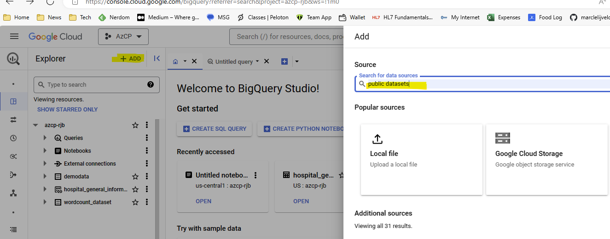
   2. 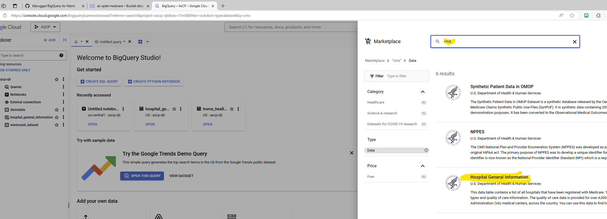
   3. 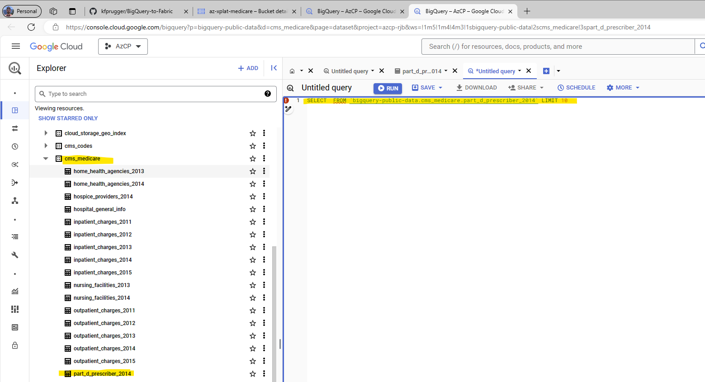
2. Next, we spin up a Dataproc cluster, GCP’s managed Spark and Hadoop service, that lets you run Apache Spark jobs on GCP. The specifics of this step are critical as Dataproc’s versions. I leaned HEAVILY on this guide and code and adapted my code to pull from the BQ public datasets. Key observation: the libraries mentioned in the original blog are a couple of years old, so I am using the older versions of Dataproc images so that I didn’t have to refactor the code on the fly.
   1. Enable the Dataproc API
   2. Create Cluster ➡️ Cluster on Compute Engine
      1. You can accept defaults, but here's what I recommend to control costs
         1. Cluster Type ➡️ Single Node
         2. Configure Nodes ➡️ Primary Disk Size ➡️ 30 GB
      2. You **MUST** add these options to your cluster
         1. Select 2.0 as the "Standard Dataproc Image"
            1. 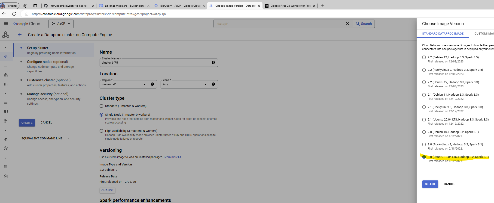
         2. You must first upload the **initialization.sh** file to a spot in GCS that you can reference in the Dataproc config. Then reference that file under Customer Cluster (optional) ➡️ Initailization Actions ➡️ point to where you uploaded **initialization.sh** in GCS. Also, deselect Interal IP only.
            1. 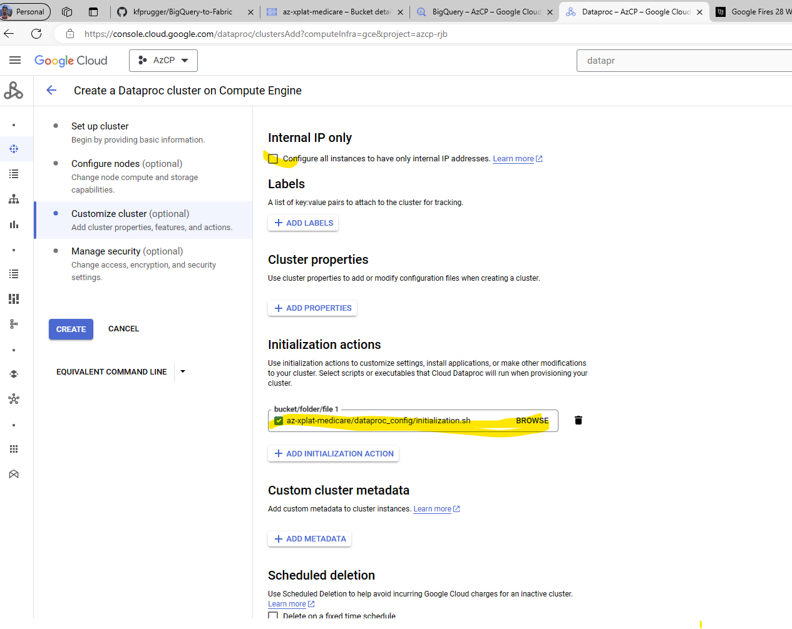
         3. Lastly, on Manage Security (optional), select "Enables the cloud-platform for this cluster" under Project access
            1. 
3. The next step is to write a Spark job that reads the BigQuery tables that you want to export and writes them to Delta Parquet files in a Cloud Storage bucket against the Dataproc cluster you just created. Again, [this step is found here](https://medium.com/analytics-vidhya/using-google-dataproc-to-create-delta-tables-c6dffa263fee). We'll use the Spark BigQuery connector, which is a library that allows Spark to read and write data from BigQuery. You can also use the Delta Lake connector, which is a library that allows Spark to read and write Delta Parquet files. The PySpark job takes both connectors and either seeds or copies changes from a certain BQ table into Delta format into a GCS bucket.
      **NOTE:** You'll need to edit Line 35 in [this script](./scripts/extract-bq-deltatable-prescriber.py) and upload it to your GCS bucket to reflect where you want your delta table files to be located on your own GCS bucket.
   1. From the Dataproc UI ➡️ Use the left menu pane and go to Jobs ➡️ Submit Job
      1. 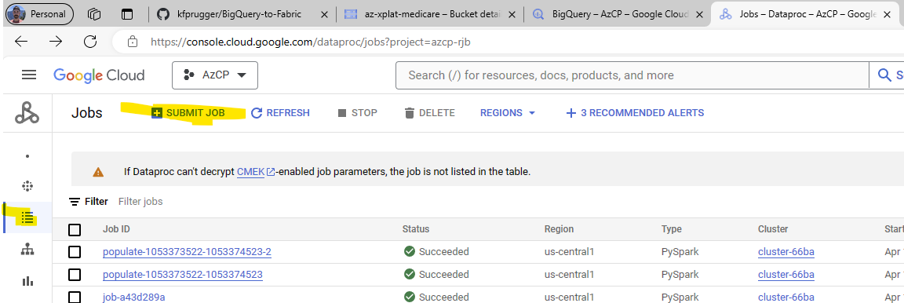
   2. Next, add in the details as listed here:
      1. Job ID = **insert a name that makes sense**
      2. Cluster = **The cluser name you created in Step 2**
      3. Job type = **PySpark**
      4. Main python file = You'll need to reference [the script you previously uploaded based on this one in the repo](./scripts/extract-bq-deltatable-prescriber.py) by using this format *gs:/<your bucket here>/python script/extract-bq-deltatable-prescriber.py*
         1. 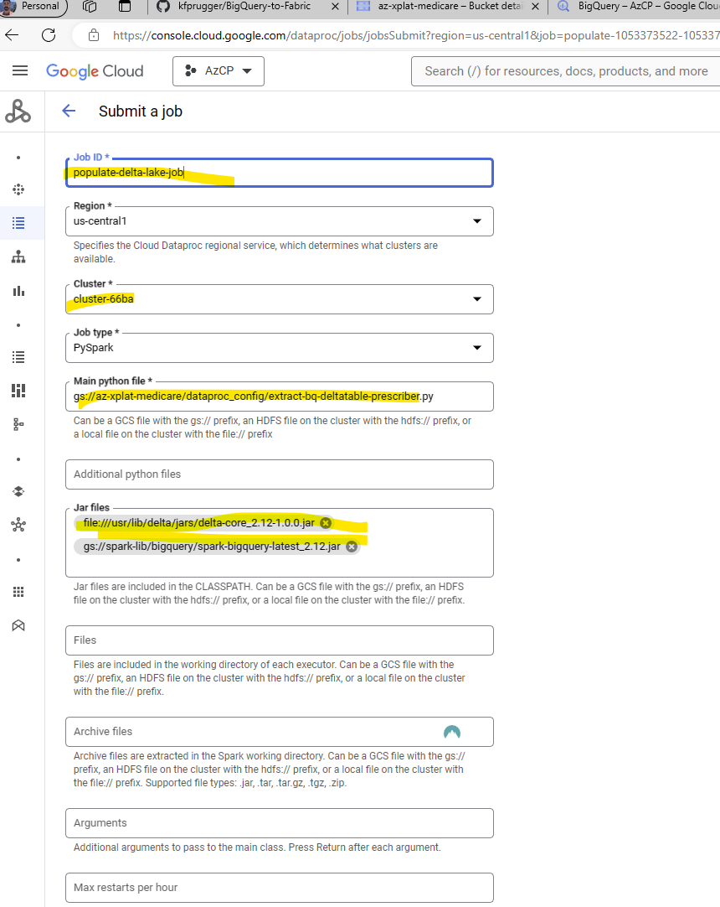
    NOTE: This setup allows for parameterized continuous export of locked away, proprietary BQ data into open-source Delta Parquet. Not only does this allow other platforms like Fabric to read the data without ETL, but it also enables a slew of other capabilities in your enterprise namely in the Data Science (ML model training, etc.) & Data Engineering (data caching and/or cross-cloud interconnects to keep multi-cloud costs to a minimum).

    I will be updating this repo to complete the auto-export from BigQuery to Delta Parquet [*automatically on a schedule*](https://cloud.google.com/dataproc/docs/tutorials/workflow-scheduler) at a later date. You can submit another job using the **./scripts/extract-bq-deltatable-prescriber-full.py**
4. The final step is to connect Microsoft Fabric to the Cloud Storage bucket that contains the Delta Parquet files. You can use the Google Cloud Storage shortcut for OneLake, which is a connector that allows Fabric to access data stored in Cloud Storage natively, to populate a Fabric Lakehouse of your choosing. In my case, I called my lakehouse “CMS_Lakehouse” which was already created from my peers’ repository and my shortcut name was “BQHospitalSampleDeltaExport”. Once you have created a shortcut, you can use default semantic model or bring your Lakehouse data into another model.
   1. First, [go to Fabric](https://app.fabric.microsoft.com/) ➡️ Data Engineering experience inside a workspace you can access. Mine is called "CMS and Diabetes Demos" in my example.
      1. 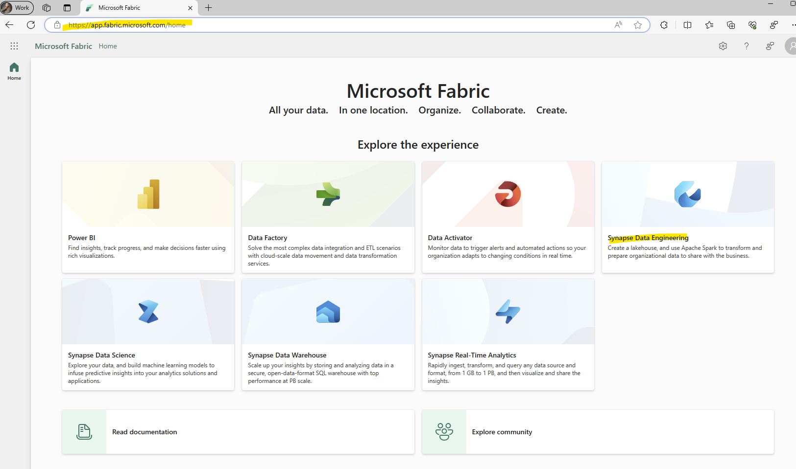
      2. Select the existing Lakehouse. Remember, most of the work in Fabric has already completed using my peers' [Fabric Medicare Part D GitHub repository](https://github.com/isinghrana/fabric-samples-healthcare/tree/main/analytics-bi-directlake-starschema). As such, I'll be reusing the lakehouse created from the instructions in that repo and augmenting the semantic model to include the GCP-based data.
         1. 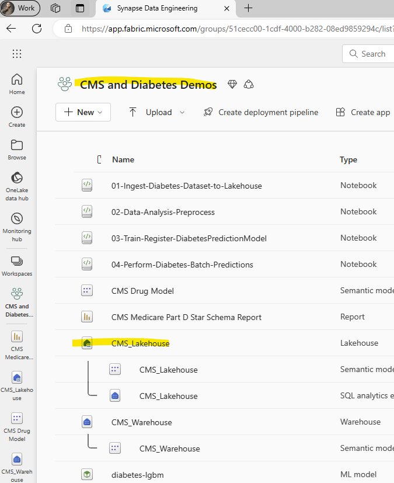
   2. Now, we'll [create the shortcut](https://learn.microsoft.com/en-us/fabric/onelake/create-gcs-shortcut) that references data in-place on Google Cloud Storage (GCS). Inside your Lakehouse ➡️ "Get data" in the ribbon ➡️ New shortcut ➡️ Google Cloud Storage
      1. NOTE: You must create a Google [HMAC Key](https://cloud.google.com/storage/docs/authentication/managing-hmackeys#create)
      2. Url = **https://BucketName.storage.googleapis.com**
      3. Connection Name = **What you'd like to name this connection in this workspace**
      4. Access ID = **Access ID -- something that looks like this: GOOG1ERCXVYTLP6OQM3NPYPGE3OVTAX724CMUOERVXES4IODCIU2ND02MR** This is not a working ID.
      5. Secret = **Something that looks like this from the HMAC Key creation: ucns4Uwxdl4qHZc471NlwR18Hdjun69823n!ndfkd7**. This is not a working secret.
   3. The lakehouse is now ready to be referenced by Fabric. We'll use OneLake's capability to reference multiple lakehouse tables in one model later in our semantic model backing the Power BI report. 
      1. 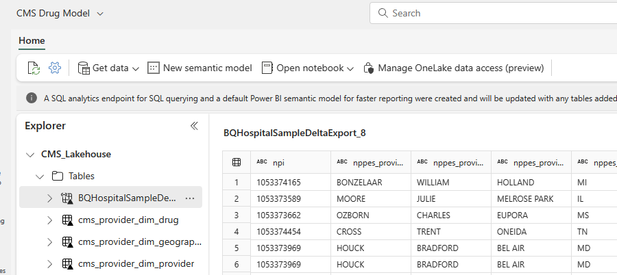
   4. Now that we have added our GCP-backed table into our primary table, we can add in that reference to the semantic model with augmented data from GCP.
      1. CMS Workspace ➡️ CMS Drug Model (created previously)
      2. Open data model in the ribbon
      3. Edit tables in the ribbon and select the BigQuery Shortcut table
         1. 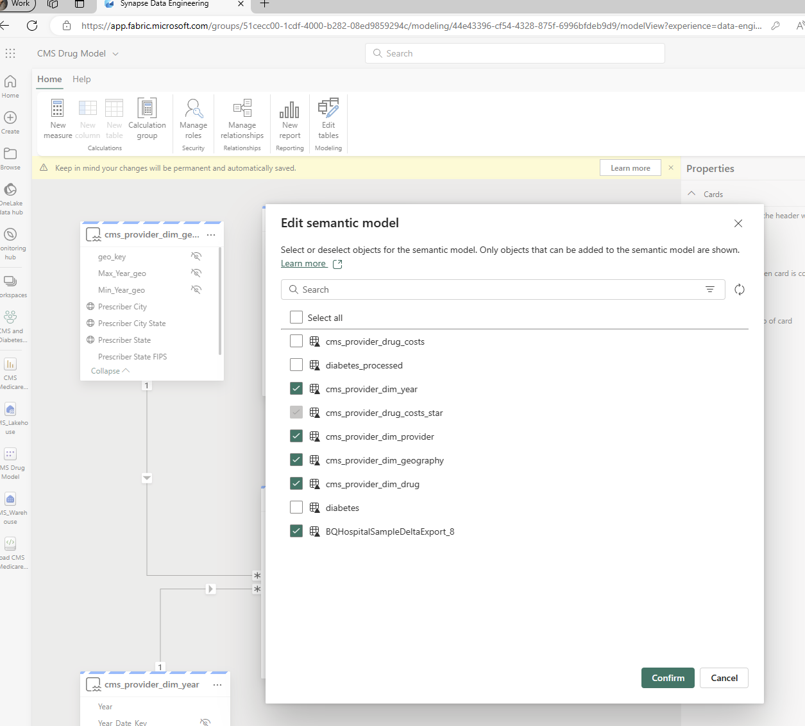
      4. Now, all that remains is repeating the steps from the original repo to [recreate relationships and column names](https://github.com/isinghrana/fabric-samples-healthcare/tree/main/analytics-bi-directlake-starschema#step-3-create-the-direct-lake-power-bi-star-schema-dataset-with-dax-expressions-and-metadata) on the new table and the report will populate with data from both **Fabric and GCP!**        Because we are augmenting the existing model, we will need to update the model generated from the Part D repo to include data from GCP to simulate using data from other clouds in a mixed-mode Power BI report. To do this, we’ll just modify the semantic model to include data from Lakehouse backed by the GCS data over in the Google Cloud.

          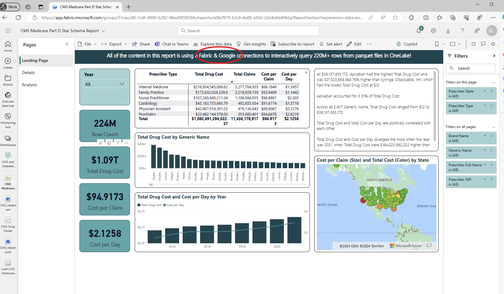
